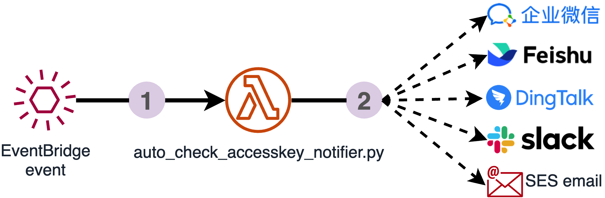
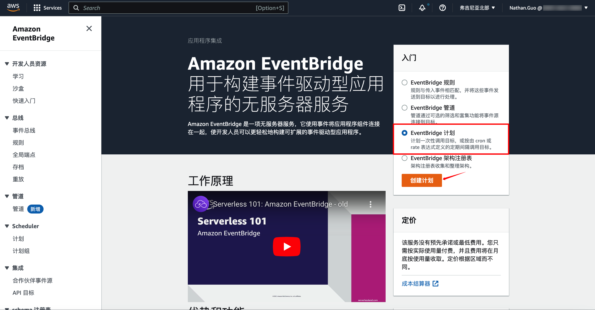

# auto_check_accesskey_notifier

## 简介

尽管在任何时候，我都建议您在能使用IAM role的地方都使用它，比如在AWS的所有服务上（包括EC2、RDS、Lambda等）。但在避免不了使用accesskey访问密钥的时候，我也建议您定期的更换密钥，来降低密钥被盗用的风险。


本文使用两种方式，带您检查使用时长过长的访问密钥。

1. 手动检查：通过控制台或aws cli命令行的方式检查，以停用您认为有风险的密钥。
2. Lambda自动检查通知：使用EventBridge、Lambda，定期自动执行Lambda来检查您使用时长过长的访问密钥，并通知到邮件、企业微信、钉钉、Slack等（本文以企业微信为例）。


## 目录

[toc]

## 实验环境

- aws-cli/2.7.3 如果 aws 版本太低还需要手工安装插件，建议升级到高版本
- python3.9


## 实战步骤


### 手动检查

#### 控制台方式


1. 控制台进入IAM(**Identity and Access Management**)身份管理服务。

2. 在用户(User)的安全证书(security certificate)栏位下，访问密钥处可以看到您当前User所创建的访问密钥(access key/secret key)列表。此处可以检查每个访问密钥的**创建时间**，状态栏处可以选择**停用**，以在合适时间合理管理您的密钥。

#### aws cli方式


1. 终端键入`aws iam list-access-keys`，查看当前User所创建的访问密钥(access key/secret key)列表，如上图所示。`CreateDate`处以检查每个访问密钥的**创建时间**。

2. （可选）终端键入`aws iam delete-access-key --access-key-id AKIxxxxxx72`(将access-key-id 替换为您的access key id)，停用对应访问密钥，以在合适时间合理管理您的密钥。


### 进阶 - Lambda自动检查并通知

#### 架构总览



Lambda函数：python编写代码，以检查该账户下所有超过30天的accesskey，并通知到后端软体，本文以企业微信为例。

EventBridge：Schedule定期执行事件，每30天执行一次Lambda，以自动完成`auto_check_accesskey_notifier.py`的任务。


#### Lambda函数部署

##### 创建Lambda函数

1. AWS Lambda服务下创建Lambda函数。


2. 运行环境选择Python3.8，使用合适的IAM角色（为了演示方便，此处使用admin权限），完成创建。


##### 打包并上传Lambda函数代码

> 以下源码以及zip文件可从Github仓库[auto_check_accesskey_notifier](https://github.com/Erlichooo/auto_check_accesskey_notifier.git)中获取

在本地空文件夹下，新建函数文件`lambda_function.py`，内容如下：

```python
from datetime import datetime
import boto3
import requests
import json
import os

# 企业微信机器人变量
tokenUrl = "https://qyapi.weixin.qq.com/cgi-bin/gettoken"
corpid = os.getenv('corpid')
corpsecret = os.getenv('corpsecret')
agentid = os.getenv('agentid')


# 获取企微token
def get_token():
    values = {'corpid': corpid, 'corpsecret': corpsecret}
    req = requests.post(tokenUrl, params=values)
    data = json.loads(req.text)
    return data["access_token"]


sendMsg = "https://qyapi.weixin.qq.com/cgi-bin/message/send?access_token="

# 发送消息到企微机器人（通过token+机器人agentid）
def send_msg(msg):
    url = sendMsg + get_token()
    print(url)
    values = """{"touser" : "@all" ,
      "msgtype":"text",
      "agentid":""" + agentid + """,
      "text":{
        "content": "%s"
      },
      "safe":"0"
      }""" % msg
    requests.post(url, values)


# 列出当前账号下超过30天的accesskey
def list_ot_accesskey():
    # Create IAM client
    iam = boto3.client('iam')

    response = iam.list_users()
    msg_aksk = ''

    # 遍历Users
    for Users in response['Users']:
        User_name = Users['UserName']
        paginator = iam.get_paginator('list_access_keys')

        for response_lsak in paginator.paginate(UserName=User_name):
            i = 0
            count_keys = len(response_lsak['AccessKeyMetadata'])

            # 遍历accesskey
            for i in range(count_keys):
                AK_Key_Id = response_lsak['AccessKeyMetadata'][i]['AccessKeyId']
                AK_Key_createDate = response_lsak['AccessKeyMetadata'][i]['CreateDate']

                # 获取当前时间
                date_now = datetime.now().date()
                AK_Key_date = AK_Key_createDate.date()

                AK_used_days = date_now - AK_Key_date
                days = int(str(AK_used_days).split(" ")[0])
                if days >= 30:
                    tmp_aksk = "\n\nAccessKey: " + AK_Key_Id + "\nIAM user: " + User_name + "\nUsage: " + str(
                        days) + " days"
                    msg_aksk = msg_aksk + tmp_aksk

    return msg_aksk


def lambda_handler(event, context):
    # 获取当前账户AccountId
    sts = boto3.client('sts')
    response_identity = sts.get_caller_identity()
    accountId = response_identity['Account']

    # 获取超过30天的accesskey
    msg_aksk = list_ot_accesskey()
    msg = "Notification Details:\nAccessKeys under your account[" + accountId + "] have been already used more than 30 days, pls check it and change another to use.\n" + msg_aksk

    # 将消息发送到企业微信
    send_msg(msg)
    print(format(msg) + '\n')
```


> 使用 python requests 库发送 post 请求：
>
> - 独立安装 requests 库，需要将包和 lambda 代码一起上传到 AWS Lambda 执行环境。以使用虚拟环境来安装函数依赖为例。[参考文档](https://docs.aws.amazon.com/zh_cn/lambda/latest/dg/python-package.html#python-package-dependencies)

1. 创建虚拟环境。

   `python3 -m venv v-env`

2. 激活环境。

   `source v-env/bin/activate`

3. 使用 pip 安装库。

   `pip install requests`

4. 停用虚拟环境。

   `deactivate`

5. 使用库内容创建一个 ZIP 存档。

   `cd v-env/lib/python3.9/site-packages`

6. 将函数代码添加到存档中

```shell
zip -r9 ${OLDPWD}/function.zip .
cd $OLDPWD
zip -g function.zip lambda_function.py
```

7. 将二进制 ZIP 部署包上传到Lambda 并更新函数代码


8. 通过更改代码或编辑函数环境变量，将`agentid`、`corpid`、`corpsecret`更改为您企业微信对应值


> tips.  agentid: 机器人代理ID，corpid: 公司ID，corpsecret: 公司密钥


#### EventBridge Schedule定时事件创建

1. Amazon EventBridge服务下，创建EventBridge 计划。



2. 指定计划。按照您的业务需求，填写合适的执行频率，本例以30天为一个周期，自动执行lambda检查本账户下使用时长过长的accessskey。


3. 选择目标。选择Lambda作为事件的执行目标，Lambda函数选择先前部署的`auto_check_accesskey_notifier`函数，完成创建。


#### 效果演示

以上已经完成使用Lambda、EventBridge自动检查并通知到企业微信的实验，效果如下图示：


## 总结

x x x x x x x


## 参考链接

[AWS Blog: 企业微信、钉钉接收 Amazon CloudWatch 告警](https://aws.amazon.com/cn/blogs/china/enterprise-wechat-and-dingtalk-receiving-amazon-cloudwatch-alarms/)

[AWS Doc: 使用 AWS Organizations 和 AWS Secrets Manager 自动大规模轮换 IAM 用户访问密钥]([使用 AWS Organizations 和 AWS Secrets Manager 自动大规模轮换 IAM 用户访问密钥 - AWS Prescriptive Guidance (amazon.com)](https://docs.aws.amazon.com/zh_cn/prescriptive-guidance/latest/patterns/automatically-rotate-iam-user-access-keys-at-scale-with-aws-organizations-and-aws-secrets-manager.html))

[Boto3 Docs: IAM examples-List a user's access keys]([Managing IAM access keys — Boto3 Docs 1.26.48 documentation (amazonaws.com)](https://boto3.amazonaws.com/v1/documentation/api/latest/guide/iam-example-managing-access-keys.html#list-a-user-s-access-keys))

[Boto3 Docs: STS-get_caller_identity()]([STS — Boto3 Docs 1.26.49 documentation (amazonaws.com)](https://boto3.amazonaws.com/v1/documentation/api/latest/reference/services/sts.html#STS.Client.get_caller_identity))

